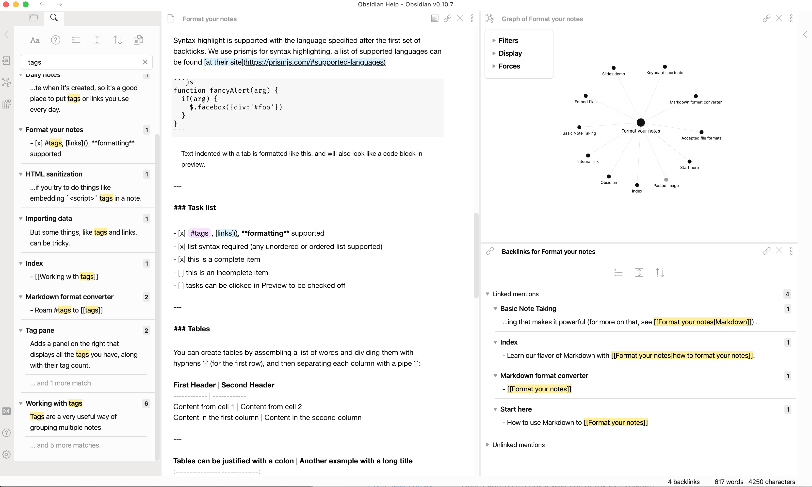

# Obsidian-highlighter-theme

Minimal and clean theme for [Obsidian](https://obsidian.md). 
The intention is to make notes look like printed on paper, with text highlighted using a highlighter pen.

Only light UI is supported.

Based on the code from [rdvd/obsidian_ia](https://github.com/rcvd/obsidian_ia) theme. Theme itself is inspired by [sublime-scheme-alabaster](https://github.com/tonsky/sublime-scheme-alabaster). 

Uses Helvetica for main text and and [Fira Code](https://github.com/tonsky/FiraCode) for monospaced items.

## Screenshots

## Installation

1. Download `obsidian.css` and place/symlink it to the vault root folder.
2. Enable the custom CSS setting in Options > Appearance